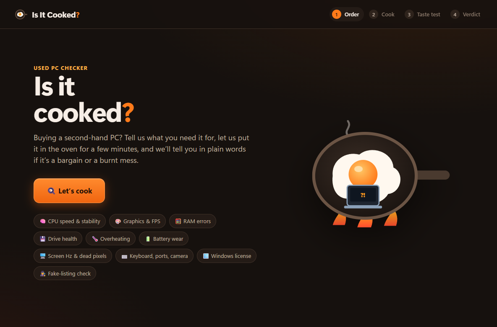
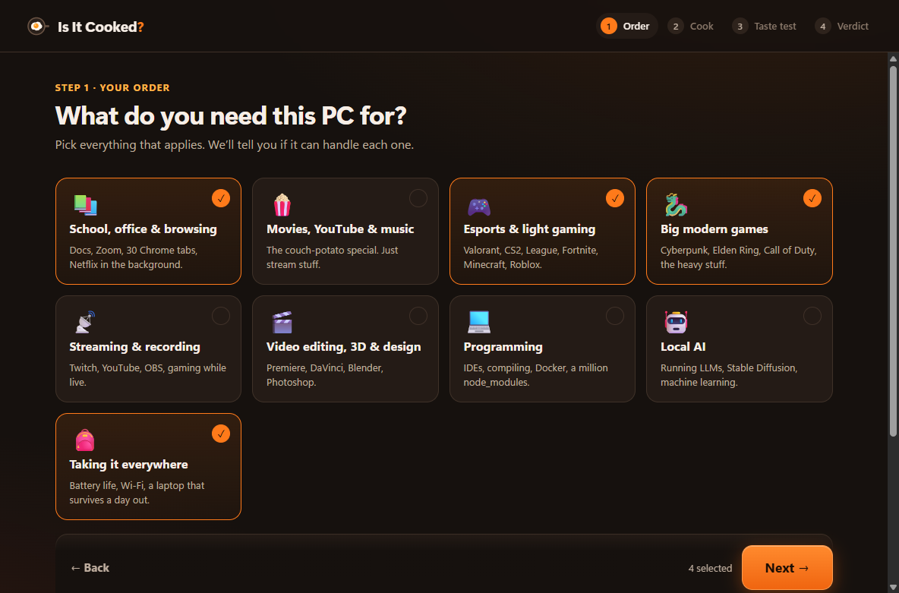
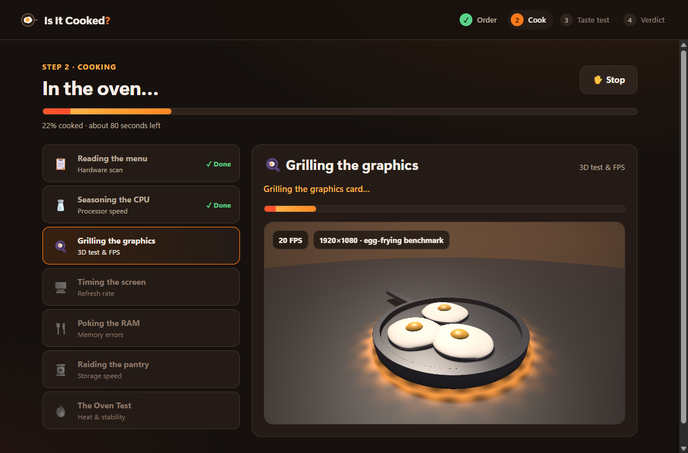
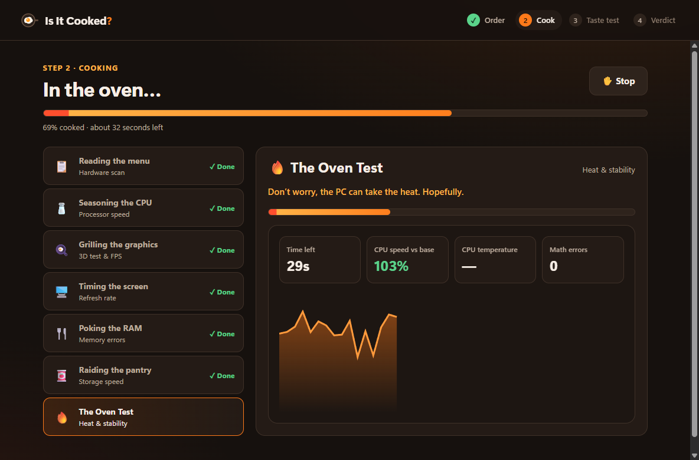
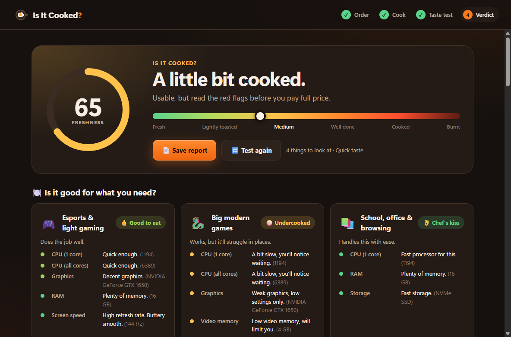

<p align="center">
  
</p>

<h1 align="center">Is It Cooked? 🍳</h1>

<p align="center">
  <b>The used-PC checker for people who don't speak "nerd".</b><br/>
  Buying a second-hand PC? Tell it what you need the PC for, let it cook for a few minutes,<br/>
  and get a plain-English verdict: bargain, or burnt mess?
</p>

<p align="center">
  <a href="https://github.com/Loseless02/Is-it-cooked-/releases/latest"><b>⬇️ Download the latest release</b></a>
</p>



## Why?

When you buy a used PC you usually get 10 minutes with it at the seller's place. Benchmark tools spit out numbers
nobody understands. **Is It Cooked?** runs every important test in one go and tells you, in normal words:

- 🍽️ **Is it good for what I need?** Gaming, school, video editing, local AI and more
- 🚩 **What's wrong with it?** Overheating, dying drive, worn battery, fake graphics card…
- 💸 **What can I haggle about?** Every problem comes with a rough fix cost
- 🗣️ **What should I ask the seller?** A ready-made question list

## How it works

| 1. Order | 2. Cook | 3. Taste test | 4. Verdict |
|---|---|---|---|
| Pick what the PC is for, and optionally type in what the listing claimed | Automatic tests (~2 min quick, ~5 min full) | Guided hands-on checks + a physical "sniff test" | Freshness score, per-use verdicts, red flags, report |

| Pick your use | The GPU "egg-frying" test |
|---|---|
|  |  |

| The Oven Test (stress & heat) | The verdict |
|---|---|
|  |  |

## What it checks

**Automatic**

| Part | What we look at |
|---|---|
| 🧠 CPU | Single- and multi-core speed, and **stability**: it verifies every calculation, so a PC that makes math errors (unstable overclock, dying CPU) gets caught |
| 🌡️ Cooling | "The Oven Test": all cores at 100%. If the CPU slows itself down from heat, the cooling is cooked |
| 🎨 Graphics | Live 3D benchmark at 1080p, GPU temperature, and a **fake / underperforming card check** |
| 🧮 RAM | Pattern test for memory errors, mismatched sticks, single-channel setups, RAM running below its rated speed |
| 💾 Storage | Drive health, wear and power-on hours (admin), write speed, responsiveness, Windows on a slow hard drive |
| 🖥️ Screen | Real refresh rate, "your 144 Hz screen is set to 60 Hz", wrong resolution |
| 🔋 Battery | Health vs. original capacity, charge cycles |
| 🪟 Windows | Activation, cracked-license detection, install date |
| 📶 Network | Wi-Fi adapter present, internet connection |
| 🕵️ Listing check | Compares what the ad said (CPU, GPU, RAM, storage) with what's actually inside |
| ⛏️ Background | Flags crypto miners running on the machine |

**Hands-on (guided)**: dead pixels, every keyboard key, touchpad, speakers (left/right + bass sweep), microphone, webcam, USB ports.

**Sniff test (your eyes, ears and nose)**: burnt smell, swollen battery, BIOS/company locks, fan noise, hinges, case damage, serial sticker and more.

**Before cooking** the app lists heavy apps running in the background (browsers, games, launchers…) and lets you close them with one click so the results are accurate.

## The verdict

Everything ends up in a **Freshness score** from 0 to 100:

| Score | Doneness | Meaning |
|---|---|---|
| 90–100 | 🥗 Fresh | Nope, not cooked |
| 75–89 | Lightly toasted | A few small things |
| 60–74 | Medium | Read the red flags before paying full price |
| 40–59 | Well done | Real problems, haggle hard or walk away |
| 20–39 | Cooked | Walk away (politely) |
| 0–19 | Burnt 💀 | Not even as a doorstop |

Each use case you picked gets its own rating: **Chef's kiss · Good to eat · Undercooked · Not on the menu**.
You can save everything as an HTML report.

## Download & run

1. Grab `IsItCooked-x.y.z-portable.exe` from the [releases page](https://github.com/Loseless02/Is-it-cooked-/releases/latest)
2. Put it on a USB stick and run it on the PC you want to buy (no install needed)
3. Say **yes** to the admin prompt: that unlocks drive health and temperature checks

> Windows SmartScreen may warn about an unrecognized app because the exe isn't code-signed.
> Click **More info → Run anyway**, or build it yourself from source (below).

**Requirements:** Windows 10 or 11, 64-bit.

## Build from source

```bash
git clone https://github.com/Loseless02/Is-it-cooked-.git
cd Is-it-cooked-
npm install
npm start          # run in development
npm run dist       # build dist/IsItCooked-<version>-portable.exe
```

Requires [Node.js](https://nodejs.org/) 20 or newer.

## Project layout

```
main.js, preload.js        Electron shell + the small, safe API the UI can call
src/main/
  system.js                hardware scan (systeminformation + one PowerShell script)
  bench.js, workers/       CPU, stress, RAM and disk tests
  apps.js                  background-app detection and closing
  ps.js                    PowerShell helpers
src/renderer/
  js/app.js                screens and flow
  js/gpuBench.js           WebGL egg-frying benchmark, refresh-rate measurement
  js/handsOn.js            interactive tests and the sniff-test checklist
  js/analyze.js            turns results into findings and the score
  js/profiles.js           use cases and their requirements
  js/gpuTiers.js           GPU performance tiers and FPS estimates
  js/copy.js               all the jokes
```

## Limitations (honest ones)

- **Fan speed** can't be read on most Windows PCs without special drivers. Cooling is judged by whether the CPU throttles under load, which is what bad fans actually cause.
- **Temperatures and drive wear** need admin rights, and some hardware doesn't report them at all.
- **Scores and FPS estimates are ballpark.** CPU scores are scaled to roughly match Cinebench R23; game FPS is estimated from the graphics card's tier.
- It's a quick health check, not a lab. Use your eyes too: the sniff test exists for a reason.

## Contributing

Issues and pull requests are welcome. Especially useful:

- New GPUs for the tier list in `src/renderer/js/gpuTiers.js`
- Calibration results from other hardware (CPU scores, egg-frying FPS)
- More recognizable background apps in `src/main/apps.js`
- Better jokes in `src/renderer/js/copy.js` 🍳

## Security

See [SECURITY.md](SECURITY.md) for how to report vulnerabilities and what the app does (and doesn't do) on your system.

## License

[MIT](LICENSE) © Loseless02
